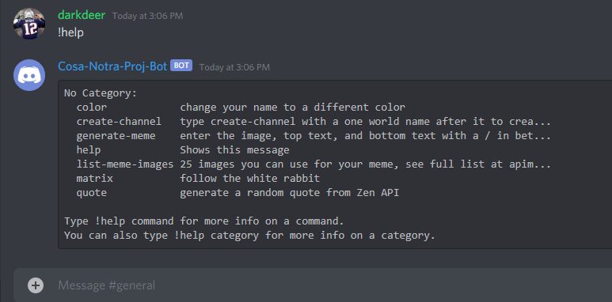
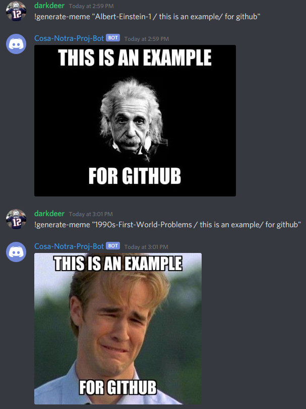
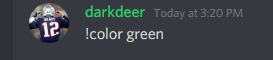
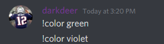

required imports
python3
discord
commands from discord.exe  
requests 
os
dotenv
pathlib

requirement to use the bot

You need to be the create of the group and allow for permissions to have the bot in your chat. You can look on the discord documentation to see how to add bots to your group.

this small project is a discord bot that uses external APIs to generate memes and random quotes on a discord chat. It is also capable of changing the role color of a user and creating a new chat channel. You can use the help command to see all available features



The following is an example of how the generate meme works



You can generate a list of 25 possible pictures to use for the meme by running typing the following in your discord chat

```
!list-meme-images
```

You can generate a random quote by using the following command

```
!quote
```

You can change the role color of the users name by typing the following command

```
!color <color_you_want_change_to>
```





here is a list of colors you can choose

```
    'default'
    'teal' 
    'turtle'                 
    'green' 
    'evergreen'
    'blue' 
    'purple'
    'violet' 
    'magenta' 
    'pink' 
    'gold' 
    'sun' 
    'orange'
    'tangerine'
    'red'
    'blood' 
```
Lastly, if you want to see all the available features for the bot just simple run the following command

```
!help
```

<h3> Contributions <h3> 
feel free to message me for the tokens to the APIs if you want 
to use or contribute to the bot 

Contact me at paul.cardoos@outlook.com

... and yes I am darkdeer on discord

